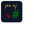

# A web version of jsdoc2md

[jsdoc2md](https://github.com/jsdoc2md/jsdoc-to-markdown) is a command line tool that you can install on your desktop pc to extract JsDoc comments in markdown format.

This is a *web version of jsdoc2md*. It is less powerful than the command line tool, but you do not have to install anything to use it. (I wrote it for documenting exports in free open source ES6 JavaScript modules on GitHub.)

> **This web version was created in a [Claude AI chat](https://claude.ai/share/dc67329f-c01d-40f6-99b6-a5a361bcb803).**
I just told Claude what I want.  So far I have only added the icon myself.

## Test it

You can [test it here](https://lborgman.github.io/jsdoc2md-web/jsdoc2md-7.html).

* 🌐 **No installation required:**
  * Private. Runs entirely in your web browser. Nothing uploaded to any server.
  * Input: Your ES6 JavaScript module.
  * Output: Markdown description of the JsDoc. Copy it to your README.

### 📝 Example Output

See the [README here](https://lborgman.github.io/basic-ui/).